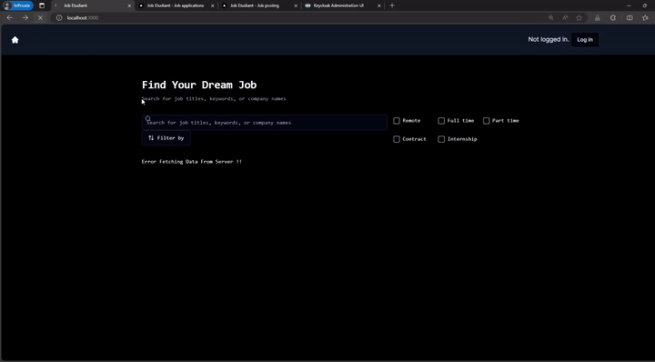
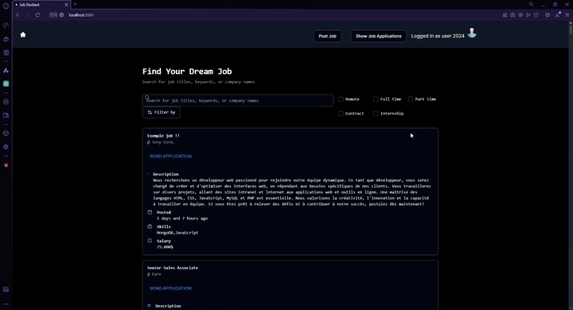
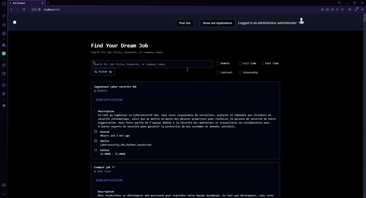
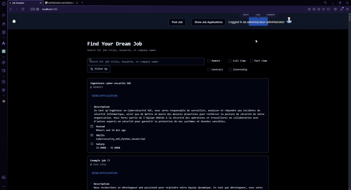

# jobetudiant_project
JobEtudiant is a job search platform that connects students job seekers with employment opportunities worldwide.

Our university project, and also a work in progress....

Project made to learn frontend, backend, restAPI developpement, and implementing Oauth authentification (with the open-source solution : Keycloak).

## Requirements
**Backend :** Java Spring

**Frontend :** Next.Js/React.js

**Others :** Keycloak (auth2.0), Docker (container), MongoDB (database)

## Demonstration

**Home page :**

###### P.S: the following actions needs Authentification

**Posting Job offers :**

**Apply to job :**

**Reviewing job applications :**

